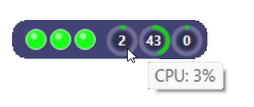

# PulsePill

A sleek, compact desktop pill widget providing real-time network latency monitoring and hardware status (CPU, RAM, GPU) at a glance.

 

## Features

- **Network Availability:** Background ping monitoring with intuitive color-coded status beads (green, yellow, red) based on response times.
- **Hardware Telemetry:** Real-time circular donut gauges displaying CPU, RAM, and GPU load percentages.
- **Minimal Footprint:** Designed to sit discreetly on your screen without cluttering your workspace.

## About the Author

- **Author:** Nicolas DUBOL
- **Version:** 1.0.7

## License & Intellectual Property

Copyright © 2026 Nicolas DUBOL. All rights reserved.

## Support the Project

If you find PulsePill useful and would like to support its development:

This project and its source code are proprietary. No part of this software may be copied, modified, distributed, reverse-engineered, or used in derivative works without the explicit written permission of the copyright holder.
